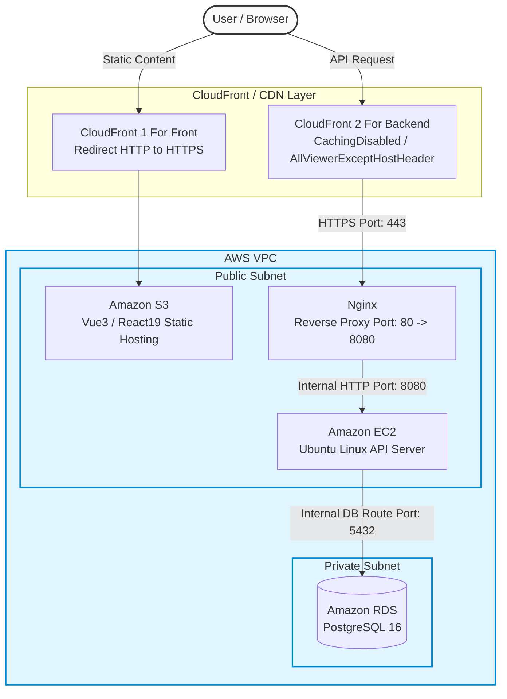

# 📋 次世代タスク管理システム (フルクラウド・マルチフロントエンド実証プロジェクト)

本プロジェクトは、フリーランスの即戦力PL/テクニカルリードとして、実務におけるモダンなシステムアーキテクチャ設計、AWSを用いた堅牢な本番インフラ構築、主要なセキュリティ脆弱性（アンチパターン）の排除、およびCI/CDによる品質管理を一貫して単独で実証するためのポートフォリオです。

単にプログラムが動くだけのモックではなく、**「独自ドメイン未取得という制約下におけるフロント/バックエンド双方の常時SSL（HTTPS）化」**や**「CDN（CloudFront）導入時に発生するCORS/OPTIONS通信のヘッダー消失トラブル」**など、実際の開発現場で直面する高度なインフラ課題を自力でトラブルシューティングし、完全開通させた商用クオリティのシステムです。

---

## 📸 画面イメージ ＆ 本番環境URL
<table>
  <tr>
    <td align="center" width="50%">
      <b>Vue 3 (Vuetify) バージョン</b> 
      
    </td>
    <td align="center" width="50%">
      <b>React 19 (MUI) バージョン</b> 
      
    </td>
  </tr>
</table>

- **本番環境（AWS / フルクラウド公開中）**: `https://d2td4ep83ibsl5.cloudfront.net/`
  ※HTTPアクセス時も、CloudFrontにより安全なHTTPS通信へ自動リダイレクトされます。

---

## 🗺️ AWS本番インフラアーキテクチャ構成図

実務のエンタープライズ標準に準拠し、フロント・バックエンド・データベースの各レイヤーをVPC内で明確に分離。最小権限の原則（セキュリティグループ間連携）に基づき、堅牢な防御ラインを構築しています。

---

## 🛠️ 技術スタック

### インフラ / クラウド (AWS)
- **Amazon CloudFront**: フロント/バック双方の前段に配置。常時SSL化およびAPIキャッシュ無効化（`CachingDisabled`）の制御。
- **Amazon S3**: フロントエンド静的ファイルのセキュアなホスティング。
- **Amazon EC2 (Ubuntu)**: Javaアプリケーションサーバー。
- **Nginx**: リバースプロキシとして導入。CloudFrontからの通信（ポート80）を受信し、Java（ポート8080）へ安全に仲介。
- **Amazon VPC**: サブネット隔離、セキュリティグループによるIP直指定を排除した「グループ間連携ファイアウォール」の設計。

### フロントエンド（マルチフロントエンド接続実証）
- **Vue 3** (Composition API, `<script setup>` 構文) / **Vuetify 3**
- **React 19** (TypeScript / Functional Component / Hooks) / **MUI (Material-UI)**
- **Axios**: 非同期HTTP通信

### バックエンド / DB
- **Java 21** (LTS 最新仕様)
- **Spring Boot 3.x**: (Spring Web, Spring Data JPA, Jakarta Validation, Spring AOP)
- **PostgreSQL 16**: (AWS RDSによる完全永続化)

### テスト & 信頼性 (CI/CD)
- **JUnit 5** / **Mockito**: サービス層のビジネスロジックに対する単体テスト自動化。
- **GitHub Actions**: リポジトリへの `push` / `PR` 時の自動ビルド・自動テスト環境の構築。

---

## 🎯 設計のこだわり ＆ 実務アピールポイント

### 1. 独自ドメイン不要のマルチCDN常時SSL（HTTPS）化（★インフラの核心）
本番Webシステムにおいて必須となる「常時SSL化」を、独自ドメインを購入・割当することなくAWS標準機能のみで実現。
HTTPS環境からHTTP環境へ通信する際にブラウザが通信を強制遮断する「Mixed Content（ミックスコンテンツ）」の脆弱性に対し、EC2内に**Nginx（リバースプロキシ）**を構築し、バックエンド専用の2枚目のCloudFrontをプロキシとして前段に配置することで解決しました。
また、フロントエンドのデプロイ（仕様変更）時に発生する古い静的ファイルの残存リスクに対し、CloudFrontの**キャッシュ無効化（Invalidation: `/*`）**を用いたCDN運用保守フェーズのトラブルシューティングまでを実証しています。

### 2. API専用のCloudFront詳細ポリシーツーリング（CORS対策）
CloudFrontをAPIサーバーの前段に置いた際に発生する「CORS通信エラー」をインフラ設定レベルで根本解決。
- **メソッド拡張**: ブラウザが安全確認のために自動送信する「OPTIONS（プリフライト）リクエスト」や、`PUT`/`DELETE`メソッドがCDNで弾かれないよう、許可されたHTTPメソッドをフル開放しOPTIONSのキャッシュも有効化。
- **ヘッダー中継（`AllViewerExceptHostHeader`）**: 
  安易な `AllViewer` 設定（アンチパターン）によって発生する「Hostヘッダーの書き換えに伴うNginxのタイムアウト（504 Gateway Timeout）」を回避。CORS判定に必要な `Origin` 等のViewerヘッダーのみを無傷でJavaへ透過させ、HostヘッダーはAWS内部の正しい宛先に書き換える適正なポリシーを設計。

### 3. アプリケーション層での正攻法CORSガード
Java（Spring Boot）側のコントローラー層（`TaskController.java`）において、開発初期に使われがちな `origins = "*"` というワイルドカードによる全開放（アンチパターン）を徹底排除。本番環境であるフロントエンド用CloudFrontのドメインのみを明示的に指定した**ホワイトリスト方式（正攻法）**を採用し、CSRF（クロスサイトリクエストフォージェリ）等の脆弱性を防いでいます。

### 4. フロントエンド：スマート・ダムコンポーネント設計とUI/UX最適化
画面の肥大化・結合度を抑えるため、状態管理を行う「親（スマート）」とUI表示に特化した「子（ダム）」の役割を明確に分離。
- **リアルタイム検索・絞り込み＆高速フロントサイド・ソート**:
  ユーザーの利用規模（タスク増大）を想定し、一覧カード内に検索窓と優先度フィルターを統合。無駄なネットワーク通信（APIの再リクエスト）を発生させず、Vue 3の **`computed`（算出プロパティ）** やReactの **`sort()` ロジック** を用いて、ブラウザのメモリ空間上だけで一瞬で並び替え・絞り込みが完結する、サーバー負荷軽減とUX最大化を両立した設計を徹底。

### 5. バックエンド：Java最新仕様の網羅とWebアンチパターン対策
- **Record型の全面採用**: DTOに `Record` を採用し、データの不変性（Immutable）の担保と可読性向上を両立。
- **Stream API / ラムダ式 / Optional**: 泥臭いfor文（手続き型）を全廃し、可読性が高くバグの温床にならない「宣言的プログラミング」を徹底。
- **生SQL結合の排除**: Spring Data JPAによる自動プレースホルダー（バインド変数）ベースのクエリ発行に委ね、SQLインジェクション脆弱性を根本からシャットアウト。
- **画面フリーズ・生エラー露出の防止**: `@RestControllerAdvice` によるグローバル例外ハンドリングを構築。予期せぬエラー発生時もスタックトレースを隠蔽した一貫性のあるJSONをフロントに返却。
- **Spring AOPによる横断関心事の分離**: `@Aspect` を用いて、全APIの開始・終了、および例外発生時におけるパフォーマンスログおよびエラーログの出力を一括制御。

### 6. 品質管理の自動化 (JUnit 5 ＆ GitHub Actions)
- `TaskService` のビジネスロジックに対し、正常系・異常系を網羅したテストコードを JUnit 5 で記述。設定ファイル（`application.properties`）をGit管理から安全に除外しつつ、GitHub ActionsのCIビルド環境へ環境変数を安全に注入（`env:`）することで、常に自動テスト（CI）をパスした品質の高いコードのみがメインブランチにマージされる実務リリースフローを完全再現。
